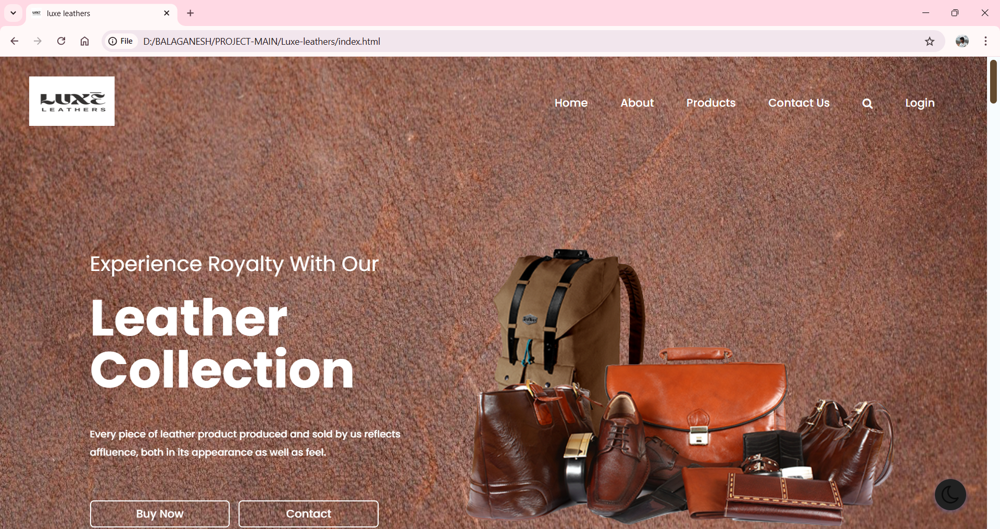
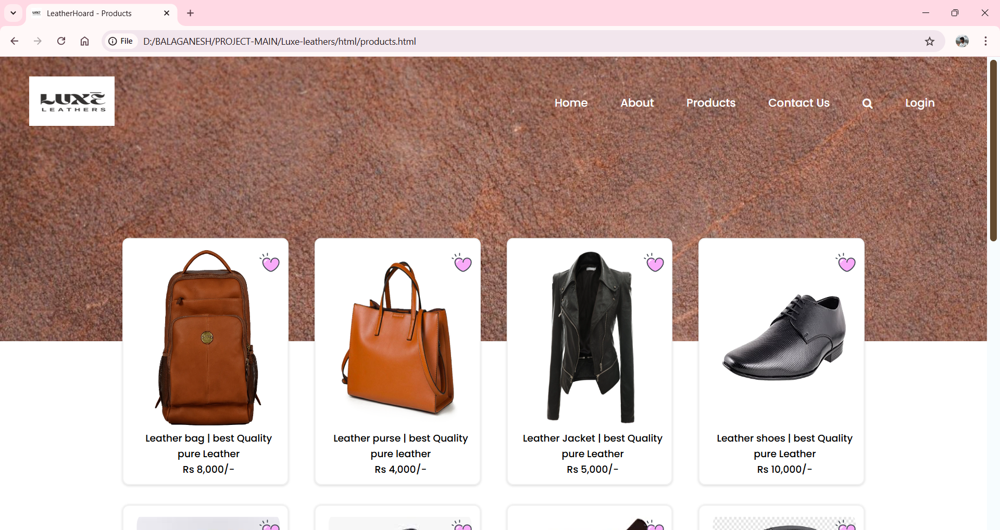
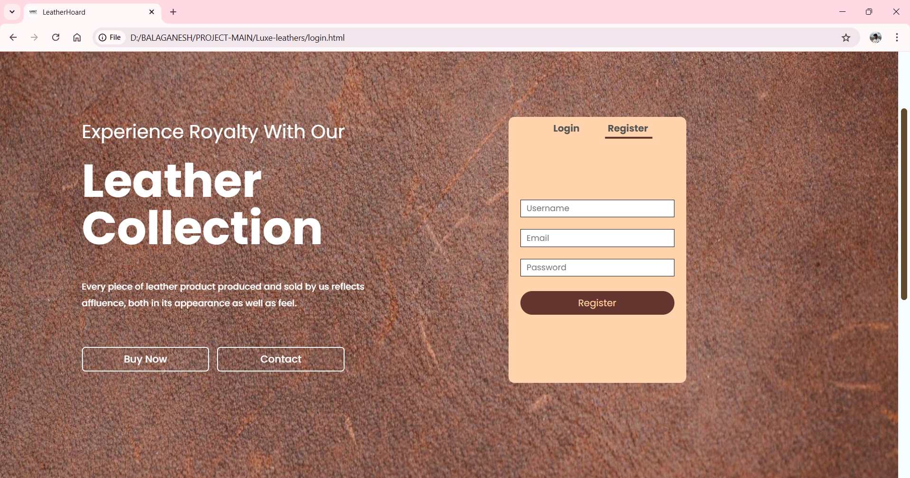
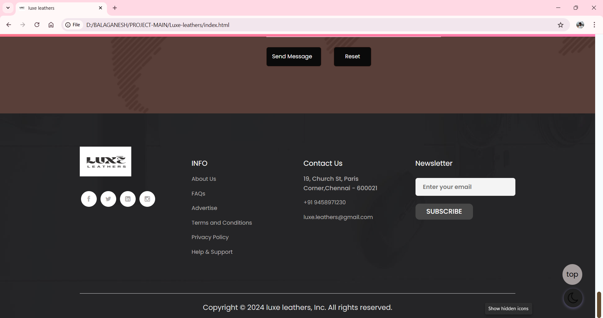
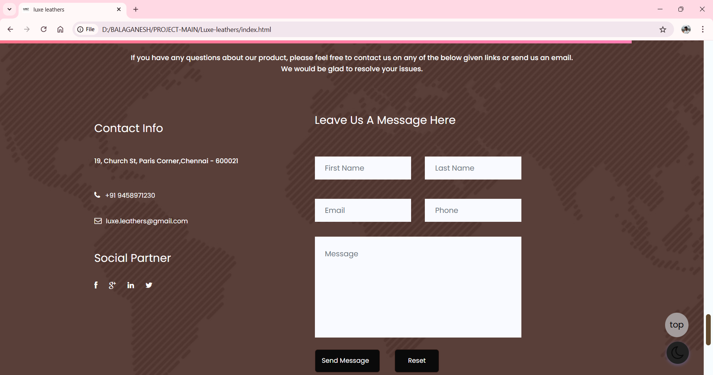
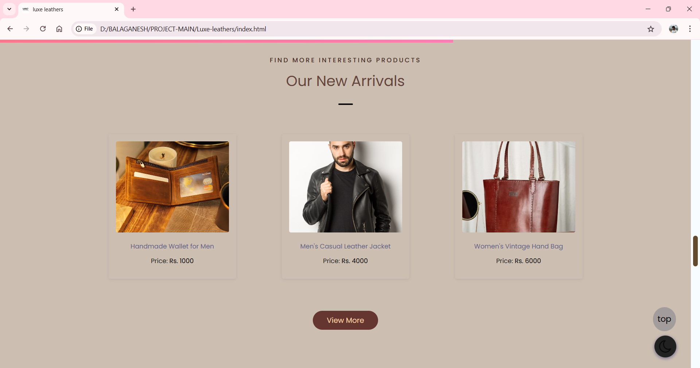
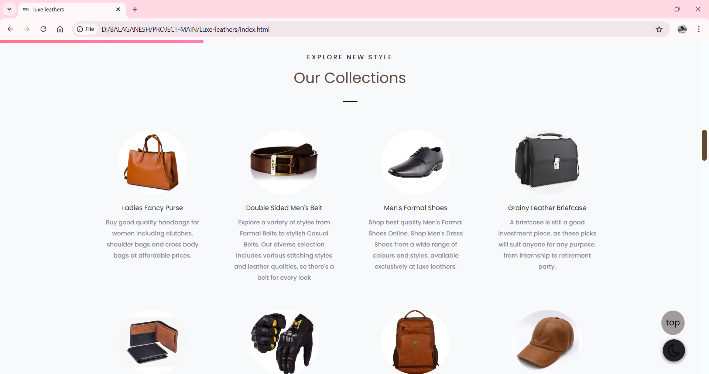
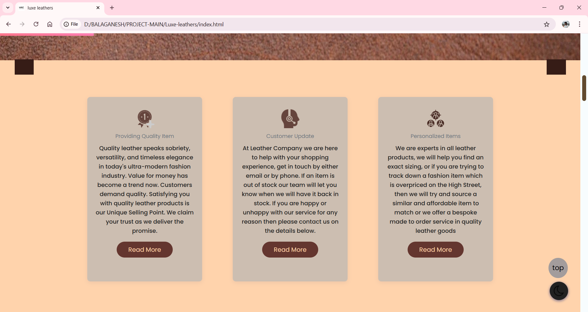

# LuxLeather

**Premium Leather Goods Online Store**

LuxLeather is a modern, responsive e-commerce website offering a premium selection of luxury leather products. From elegant wallets and sophisticated belts to stylish handbags and premium jackets, the platform delivers an upscale online shopping experience with clean design, intuitive navigation, and seamless functionality.

---

## 🎯 Key Highlights

- **🛍️ Premium E-commerce Experience** - Luxury shopping interface for leather goods
- **📱 Fully Responsive Design** - Perfect viewing on all devices and screen sizes
- **🎨 Elegant UI/UX** - Minimalist design showcasing product luxury
- **⚡ Interactive Features** - Smooth animations and dynamic product galleries
- **🔒 Secure Checkout** - Streamlined and secure purchase process
- **🌐 Live Demo Available** - [View the website](https://bala1403.github.io/Luxe-leathers/)

---

## 📋 Table of Contents

- [Features](#-features)
- [System Architecture](#-system-architecture)
- [Usage Guide](#-usage-guide)
- [Technical Implementation](#-technical-implementation)
- [Screenshots](#-screenshots)
- [License](#-license)

---

## ✨ Features

### E-commerce Functionality
- **Product Catalog** - Comprehensive display of premium leather goods
- **Dynamic Product Gallery** - Interactive product showcases with detailed views
- **Category Navigation** - Organized browsing by product types (wallets, belts, handbags, jackets)
- **Detailed Product Information** - Complete descriptions, specifications, and pricing
- **Secure Checkout Process** - Streamlined purchase flow with form validation
- **Price Display** - Clear pricing information for all products

### User Experience
- **Responsive Design** - Seamless experience across mobile, tablet, and desktop
- **Elegant Interface** - Professional, minimalist design highlighting luxury
- **Intuitive Navigation** - FontAwesome icons and clear category structure
- **Smooth Animations** - JavaScript-powered interactions for premium feel
- **Fast Loading** - Optimized performance for quick page loads
- **Cross-Browser Compatibility** - Works perfectly on all modern browsers

---

## 🏗 System Architecture

LuxLeather employs a modern front-end architecture built with proven web technologies to deliver a premium e-commerce experience:

### 1. 🏷️ HTML5 Structure Layer

**Purpose**: Provides semantic structure and content organization for the e-commerce platform

**Key Components**:
- **Header Section**
  - Navigation bar with logo and menu items
  - Search functionality and user account access
  - Shopping cart icon with item counter
  - Responsive mobile menu toggle

- **Product Catalog Structure**
  - Semantic product grid layout
  - Category-based content organization
  - Product card templates with consistent structure
  - Detailed product page layouts

- **E-commerce Elements**
  - Shopping cart and checkout forms
  - Product filter and sorting options
  - Customer review and rating sections
  - Contact and support page structures

- **Footer Components**
  - Company information and links
  - Social media integration
  - Newsletter subscription forms
  - Legal and policy page links

### 2. 🎨 CSS3 & Bootstrap Styling Layer

**Purpose**: Creates an elegant, responsive visual experience that reflects luxury branding

**Key Features**:
- **Bootstrap Framework Integration**
  - Responsive grid system for consistent layouts
  - Pre-built components for rapid development
  - Mobile-first responsive design approach
  - Cross-browser compatibility ensured

- **Custom Luxury Design System**
  - Premium color palette reflecting leather aesthetics
  - Elegant typography with readable font hierarchy
  - Sophisticated spacing and layout principles
  - High-quality visual elements and textures

- **Product Presentation Styling**
  - Gallery layouts optimized for product photography
  - Hover effects and transitions for interactive elements
  - Card-based design for consistent product display
  - Professional pricing and specification layouts

- **Responsive Design Implementation**
  - Fluid layouts that adapt to all screen sizes
  - Mobile-optimized navigation and touch interactions
  - Tablet-friendly product browsing experience
  - Desktop-enhanced shopping cart and checkout

### 3. ⚙️ JavaScript Functionality Layer

**Purpose**: Enables dynamic interactions and enhanced user experience

**Key Features**:
- **Interactive Product Gallery**
  - Image zoom and carousel functionality
  - Dynamic product filtering and sorting
  - Real-time search with instant results
  - Product comparison features

- **Shopping Cart Management**
  - Add/remove items with immediate feedback
  - Quantity adjustment with price updates
  - Cart persistence across browser sessions
  - Checkout form validation and processing

- **User Interface Enhancements**
  - Smooth scrolling and page transitions
  - Loading animations and progress indicators
  - Interactive elements with hover effects
  - Modal dialogs for product details

- **Performance Optimizations**
  - Lazy loading for product images
  - Debounced search functionality
  - Efficient DOM manipulation
  - Minimized JavaScript bundle size

### 4. 🎯 FontAwesome Icon Integration

**Purpose**: Provides consistent, professional iconography throughout the platform

**Implementation**:
- **Navigation Enhancement**
  - Clear category icons for intuitive browsing
  - Shopping cart and user account indicators
  - Search and filter interface icons
  - Social media and contact icons

- **Product Interface Icons**
  - Wishlist and comparison feature icons
  - Rating stars and review indicators
  - Shipping and return policy icons
  - Payment method and security badges

---

## 📱 Usage Guide

### Customer Shopping Experience

#### 1. **Browse Products**
   - Visit the homepage to explore featured leather goods
   - Use category navigation to find specific product types
   - Apply filters to narrow down product selections
   - View detailed product information and high-quality images

#### 2. **Product Selection**
   - Click on products to view detailed specifications
   - Check available sizes, colors, and customization options
   - Read customer reviews and ratings
   - Compare similar products using comparison tools

#### 3. **Shopping Cart Management**
   - Add desired items to the shopping cart
   - Adjust quantities and remove unwanted items
   - Review total price including taxes and shipping
   - Proceed to secure checkout when ready

#### 4. **Checkout Process**
   - Enter shipping and billing information
   - Select preferred payment method
   - Review order summary and terms
   - Complete purchase with confirmation

### Navigation Features

#### Product Categories
- **Wallets**: Premium leather wallets for men and women
- **Belts**: Sophisticated leather belts in various styles
- **Handbags**: Elegant handbags and purses for all occasions
- **Jackets**: Luxury leather jackets and outerwear
- **Accessories**: Additional leather goods and accessories

#### Shopping Tools
- **Search Functionality**: Find specific products quickly
- **Filter Options**: Sort by price, brand, color, and rating
- **Wishlist**: Save favorite items for future purchase
- **Product Comparison**: Compare features and prices

### Mobile Experience
- **Touch-Friendly Interface**: Optimized for mobile shopping
- **Responsive Images**: High-quality product photos on all devices
- **Mobile Checkout**: Streamlined purchase process for mobile users
- **Fast Loading**: Optimized performance for mobile networks

---

## 🔧 Technical Implementation

### Technology Stack
- **HTML5**: Semantic markup and modern web standards
- **CSS3**: Advanced styling with animations and transitions
- **JavaScript (ES6+)**: Modern JavaScript for dynamic functionality
- **Bootstrap 5**: Responsive framework for consistent layouts
- **FontAwesome**: Professional icon library for enhanced UX

### Architecture Highlights
- **Component-Based Design**: Modular, reusable interface components
- **Mobile-First Approach**: Responsive design starting from mobile screens
- **Progressive Enhancement**: Core functionality works without JavaScript
- **SEO Optimization**: Semantic HTML and proper meta tag implementation

### Performance Features
- **Optimized Images**: Compressed product photos for fast loading
- **Minified Assets**: Reduced CSS and JavaScript file sizes
- **Browser Caching**: Efficient resource caching strategies
- **Cross-Browser Testing**: Verified compatibility across major browsers

### Security Considerations
- **Form Validation**: Client-side and server-side input validation
- **Secure Checkout**: HTTPS enforcement and secure payment processing
- **Data Protection**: User privacy and information security measures
- **XSS Prevention**: Input sanitization and output encoding

---

## 📸 Screenshots

### Homepage and Product Showcase

*Elegant homepage featuring premium leather products and intuitive navigation*

*Comprehensive product catalog with category-based organization*

### Product Details and Shopping Experience

*Detailed product view with high-quality images and comprehensive information*

*User-friendly shopping cart with clear pricing and checkout options*

### Category Pages and Product Variety

*Premium wallet collection showcasing variety and quality*

*Elegant handbag displays with detailed product information*

### Mobile Experience and Responsive Design

*Mobile-optimized interface ensuring seamless shopping on all devices*

*Streamlined checkout process with secure payment options*

---

## 📄 License

This project is licensed under the MIT License - see the [LICENSE](LICENSE) file for details.